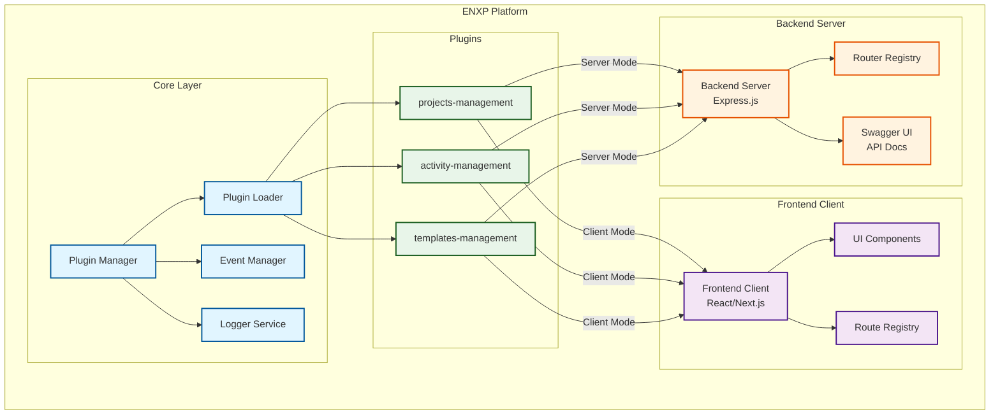
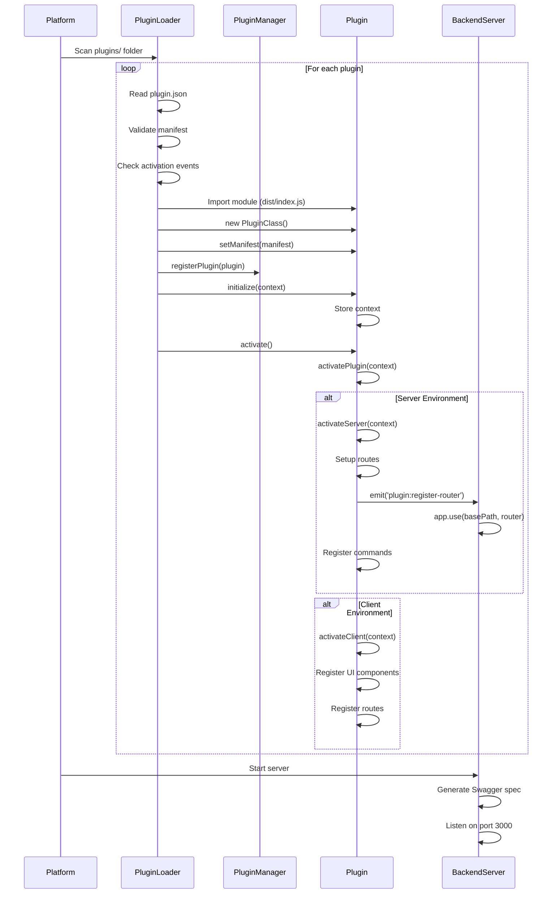
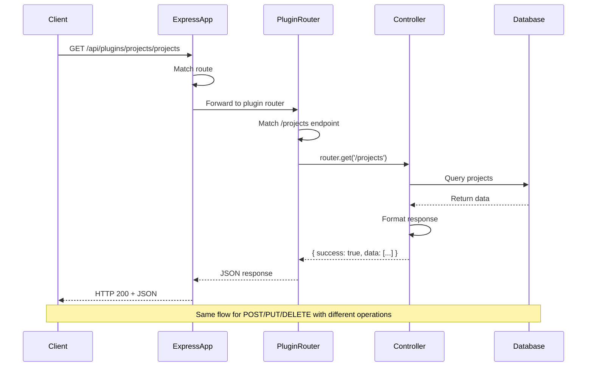
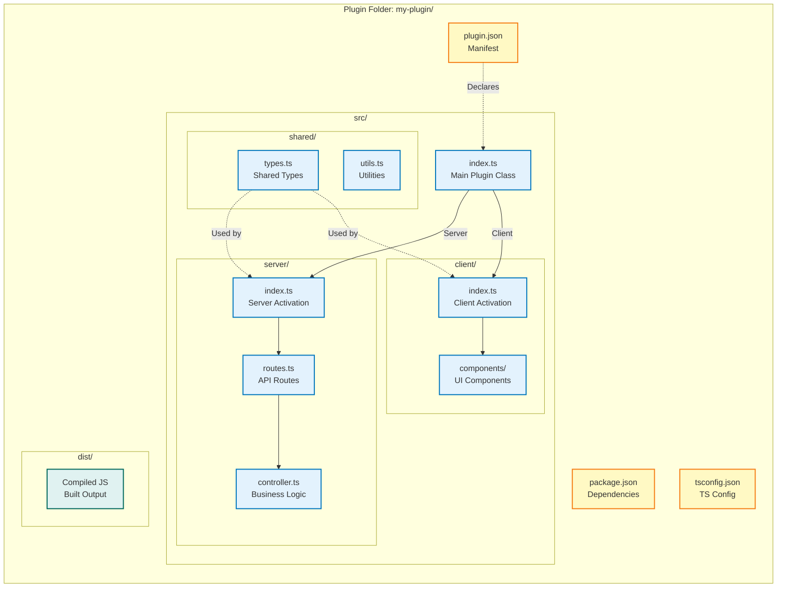
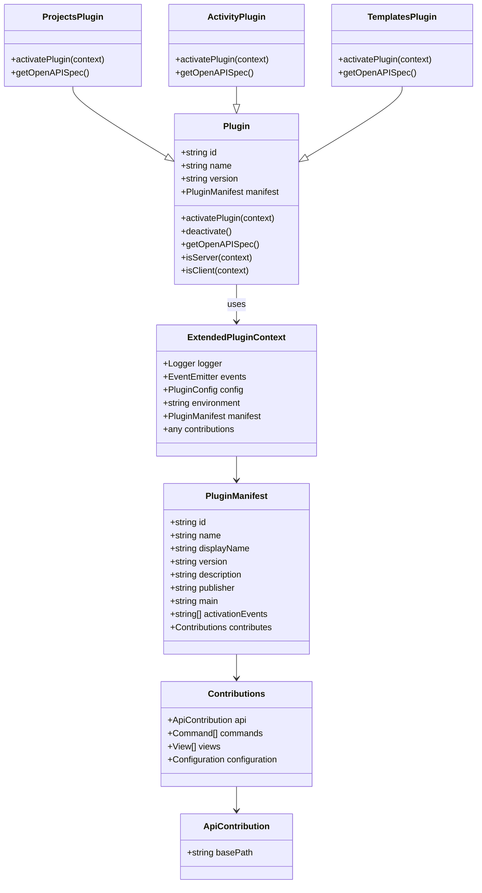
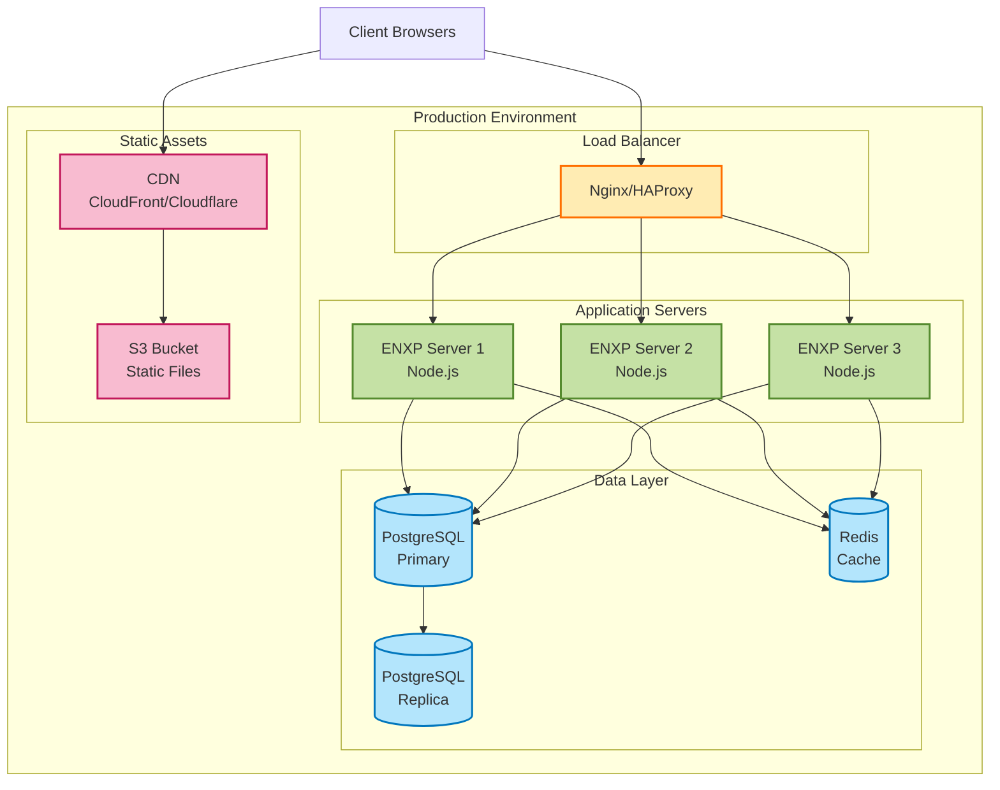
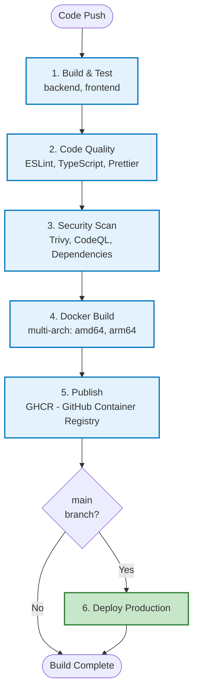
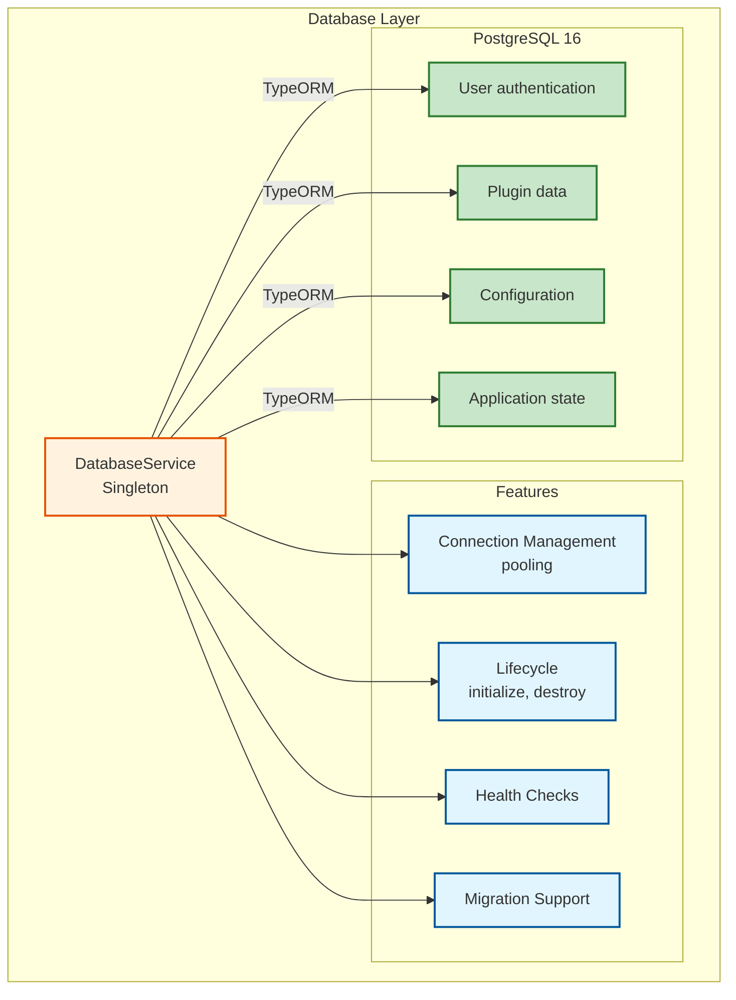

# ENXP Platform Architecture

## Overview

ENXP is a plugin-based engineering platform that enables plug-and-play extensibility using a VS Code-inspired unified plugin architecture.

## System Architecture



## Component Breakdown

### 1. Core Package (@enxp/core)

**Purpose**: Foundation for all plugins

**Key Components**:
- `IPlugin` - Base plugin interface
- `BasePlugin` - Abstract plugin class
- `PluginManager` - Central plugin orchestrator
- `PluginRegistry` - Plugin storage and lookup
- `PluginLoader` - Dynamic plugin loading
- `EventEmitter` - Event system for communication
- `Logger` - Logging infrastructure

**Responsibilities**:
- Define plugin contracts
- Manage plugin lifecycle
- Provide inter-plugin communication
- Handle plugin dependencies

### 2. Backend Package (@enxp/backend)

**Purpose**: Server-side plugin infrastructure

**Key Components**:
- `BackendPlugin` - Backend plugin base class
- `BackendServer` - Express-based server with plugin support
- `APIRoute` - Route definition interface
- `IService` - Service interface
- `IModel` - Database model interface

**Features**:
- Express.js integration
- Automatic route registration
- Middleware support
- Service injection
- Database model registration

### 3. Frontend Package (@enxp/frontend)

**Purpose**: Client-side plugin infrastructure

**Key Components**:
- `FrontendPlugin` - Frontend plugin base class
- `PluginProvider` - React context provider
- `usePlugins` - Hook to access plugins
- `usePluginRoutes` - Hook for routes
- `usePluginWidgets` - Hook for widgets

**Features**:
- React integration
- Component registration
- Route management
- Widget system
- Theme support
- Menu integration

### 4. CLI Package (@enxp/cli)

**Purpose**: Developer tools for plugin management

**Key Components**:
- `PluginGenerator` - Scaffold new plugins
- `PluginBuilder` - Compile plugins
- `PluginInstaller` - Install/uninstall plugins

**Commands**:
- `create` - Generate plugin structure
- `build` - Compile TypeScript
- `install` - Install to platform
- `uninstall` - Remove plugin
- `list` - Show installed plugins
- `dev` - Development mode with watch

## Plugin Lifecycle



## Data Flow

### Request Flow



### Plugin Data Flow

```mermaid
flowchart TD
    subgraph "Client Layer"
        Browser[Browser/UI]
        API[API Client]
    end
    
    subgraph "Server Layer"
        Express[Express Server<br/>Port 3000]
        
        subgraph "Plugin Routes"
            ProjectsAPI[/api/plugins/projects/*]
            ActivityAPI[/api/plugins/activity-management/*]
            TemplatesAPI[/api/plugins/templates-management/*]
        end
        
        subgraph "Plugin Controllers"
            ProjectsCtrl[Projects Controller]
            ActivityCtrl[Activity Controller]
            TemplatesCtrl[Templates Controller]
        end
    end
    
    subgraph "Data Layer"
        Memory[(In-Memory<br/>Data Store)]
        Database[(PostgreSQL<br/>Optional)]
    end
    
    Browser -->|HTTP Request| API
    API -->|REST API| Express
    
    Express -->|Route Match| ProjectsAPI
    Express -->|Route Match| ActivityAPI
    Express -->|Route Match| TemplatesAPI
    
    ProjectsAPI --> ProjectsCtrl
    ActivityAPI --> ActivityCtrl
    TemplatesAPI --> TemplatesCtrl
    
    ProjectsCtrl <-->|CRUD| Memory
    ActivityCtrl <-->|CRUD| Memory
    TemplatesCtrl <-->|CRUD| Memory
    
    Memory -.->|Optional| Database
    
    ProjectsCtrl -->|JSON Response| Express
    ActivityCtrl -->|JSON Response| Express
    TemplatesCtrl -->|JSON Response| Express
    
    Express -->|HTTP Response| Browser
    
    classDef clientClass fill:#e1f5ff,stroke:#01579b,stroke-width:2px
    classDef serverClass fill:#fff3e0,stroke:#e65100,stroke-width:2px
    classDef dataClass fill:#c8e6c9,stroke:#2e7d32,stroke-width:2px
    
    class Browser,API clientClass
    class Express,ProjectsAPI,ActivityAPI,TemplatesAPI,ProjectsCtrl,ActivityCtrl,TemplatesCtrl serverClass
    class Memory,Database dataClass
```

## Plugin Structure



## Plugin Loading Flow

```mermaid
flowchart TD
    Start([Platform Starts]) --> ScanFolder[Scan plugins/ folder]
    
    ScanFolder --> CheckManifest{plugin.json<br/>exists?}
    CheckManifest -->|No| Skip[Skip folder]
    CheckManifest -->|Yes| LoadManifest[Load manifest]
    
    LoadManifest --> ValidateManifest{Valid<br/>manifest?}
    ValidateManifest -->|No| Error1[Log error & skip]
    ValidateManifest -->|Yes| CheckActivation{Check activation<br/>events}
    
    CheckActivation -->|Should activate| ImportModule[Import module from main]
    CheckActivation -->|Not yet| RegisterDeferred[Register for later activation]
    
    ImportModule --> CheckExport{Has default<br/>export?}
    CheckExport -->|No| Error2[Error: No export]
    CheckExport -->|Yes| CreateInstance[new PluginClass()]
    
    CreateInstance --> SetManifest[plugin.setManifest()]
    SetManifest --> RegisterPlugin[PluginManager.registerPlugin()]
    
    RegisterPlugin --> Initialize[plugin.initialize(context)]
    Initialize --> Activate[plugin.activate()]
    
    Activate --> CheckEnv{Check<br/>environment}
    
    CheckEnv -->|Server| ActivateServer[activateServer(context)]
    CheckEnv -->|Client| ActivateClient[activateClient(context)]
    
    ActivateServer --> RegisterRouter[Emit plugin:register-router]
    ActivateServer --> RegisterCommands[Register commands]
    
    ActivateClient --> RegisterUI[Register UI components]
    ActivateClient --> RegisterRoutes[Register routes]
    
    RegisterRouter --> Success([Plugin Active])
    RegisterCommands --> Success
    RegisterUI --> Success
    RegisterRoutes --> Success
    
    Skip --> NextPlugin{More<br/>plugins?}
    Error1 --> NextPlugin
    Error2 --> NextPlugin
    Success --> NextPlugin
    RegisterDeferred --> NextPlugin
    
    NextPlugin -->|Yes| CheckManifest
    NextPlugin -->|No| Complete([All Plugins Loaded])
    
    classDef successClass fill:#c8e6c9,stroke:#2e7d32,stroke-width:2px
    classDef errorClass fill:#ffcdd2,stroke:#c62828,stroke-width:2px
    classDef processClass fill:#bbdefb,stroke:#1565c0,stroke-width:2px
    
    class Success,Complete successClass
    class Error1,Error2,Skip errorClass
    class LoadManifest,ImportModule,CreateInstance,RegisterPlugin,Initialize,Activate processClass
```

## Swagger Documentation Generation

```mermaid
flowchart LR
    subgraph "Backend Server"
        Route1[GET /api-docs]
        Route2[GET /api-docs/json]
    end
    
    subgraph "Swagger Generation"
        Gen[generateSwaggerSpec()]
        
        Loop[Loop through<br/>registered plugins]
        
        GetSpec[plugin.getOpenAPISpec()]
        
        Merge[Merge paths & schemas]
        
        Output[OpenAPI 3.0 JSON]
    end
    
    subgraph "Plugin Methods"
        P1Spec[projects-management<br/>getOpenAPISpec()]
        P2Spec[activity-management<br/>getOpenAPISpec()]
        P3Spec[templates-management<br/>getOpenAPISpec()]
    end
    
    Route1 --> Gen
    Route2 --> Gen
    
    Gen --> Loop
    
    Loop --> P1Spec
    Loop --> P2Spec
    Loop --> P3Spec
    
    P1Spec --> GetSpec
    P2Spec --> GetSpec
    P3Spec --> GetSpec
    
    GetSpec --> Merge
    
    Merge --> Output
    
    Output --> SwaggerUI[Swagger UI]
    Output --> JSONEndpoint[JSON Endpoint]
    
    classDef routeClass fill:#fff3e0,stroke:#e65100,stroke-width:2px
    classDef processClass fill:#e1f5ff,stroke:#01579b,stroke-width:2px
    classDef pluginClass fill:#e8f5e9,stroke:#1b5e20,stroke-width:2px
    classDef outputClass fill:#f3e5f5,stroke:#4a148c,stroke-width:2px
    
    class Route1,Route2 routeClass
    class Gen,Loop,GetSpec,Merge processClass
    class P1Spec,P2Spec,P3Spec pluginClass
    class Output,SwaggerUI,JSONEndpoint outputClass
```

## Plugin Communication

```mermaid
graph TB
    subgraph "Event Emitters"
        Plugin1[Plugin A]
        Plugin2[Plugin B]
        Platform[Platform Core]
    end
    
    subgraph "Event Bus"
        EventManager[Event Manager<br/>EventEmitter]
    end
    
    subgraph "Event Listeners"
        Plugin3[Plugin C]
        Plugin4[Plugin D]
        BackendServer[Backend Server]
    end
    
    Plugin1 -->|emit('data:updated')| EventManager
    Plugin2 -->|emit('user:created')| EventManager
    Platform -->|emit('plugin:loaded')| EventManager
    
    EventManager -->|on('data:updated')| Plugin3
    EventManager -->|on('user:created')| Plugin4
    EventManager -->|on('plugin:register-router')| BackendServer
    
    Plugin1 -.->|Direct call| Plugin2
    
    Note1[Cross-plugin<br/>communication]
    Note2[Platform events]
    Note3[Plugin registration]
    
    classDef emitterClass fill:#ffecb3,stroke:#ff6f00,stroke-width:2px
    classDef busClass fill:#c5e1a5,stroke:#558b2f,stroke-width:2px
    classDef listenerClass fill:#b3e5fc,stroke:#0277bd,stroke-width:2px
    
    class Plugin1,Plugin2,Platform emitterClass
    class EventManager busClass
    class Plugin3,Plugin4,BackendServer listenerClass
```

### Event-Based Communication

```typescript
// Plugin A emits event
pluginA.emit('data:updated', { id: 123, value: 'new' });

// Plugin B listens
context.events.on('plugin:pluginA:data:updated', (data) => {
  // Handle the update
});
```

### Direct Plugin Calls

```typescript
// Plugin A exposes method
class PluginA extends BackendPlugin {
  async getData(id: string) {
    return this.database.find(id);
  }
}

// Plugin B calls Plugin A
const data = await this.callPlugin('pluginA', 'getData', '123');
```

### Shared Services

```typescript
// Plugin registers service
context.api.registerService('cache', cacheService);

// Other plugin uses service
const cache = this.getService('cache');
await cache.set('key', 'value');
```

## Security Considerations

1. **Plugin Isolation**: Each plugin runs in the same process but has isolated context
2. **API Access Control**: Middleware can protect routes
3. **Event Namespacing**: Events are namespaced by plugin ID
4. **Dependency Validation**: Dependencies checked before activation
5. **Configuration Validation**: Plugin configs validated on load

## Scalability

1. **Lazy Loading**: Plugins loaded on-demand
2. **Modular Architecture**: Independent plugin development
3. **Horizontal Scaling**: Backend server can be replicated
4. **Plugin Caching**: Compiled plugins cached
5. **Event Debouncing**: High-frequency events can be throttled

## Extension Points

Developers can extend the platform by:

1. **Custom Plugin Types**: Create new base classes
2. **Platform Services**: Register global services
3. **Middleware**: Add request/response processors
4. **Event Handlers**: React to platform events
5. **CLI Commands**: Add custom CLI tools

## Plugin Context Structure



## Technology Stack

- **Language**: TypeScript
- **Backend**: Express.js, Node.js
- **Frontend**: React 18.2, Ant Design 5.28
- **Database**: PostgreSQL 16, TypeORM 0.3.19
- **Build**: TypeScript Compiler, Vite 5.4
- **CLI**: Commander.js
- **Events**: EventEmitter3
- **Package Manager**: npm workspaces
- **Deployment**: Docker, docker-compose
- **CI/CD**: GitHub Actions (4 workflows)

## Deployment Architecture



### CI/CD Pipeline



### Database Architecture



> For complete deployment details, see [DOCKER_DEPLOYMENT.md](DOCKER_DEPLOYMENT.md)  
> For CI/CD pipeline details, see [GITHUB_ACTIONS.md](GITHUB_ACTIONS.md)

## Performance Considerations

1. **Plugin Loading**: Asynchronous with parallel capability
2. **Route Registration**: Cached after initial load
3. **Event System**: Optimized with EventEmitter3
4. **Build Process**: Incremental compilation
5. **Bundle Size**: Tree-shaking for unused code

## Development Workflow

```mermaid
flowchart TD
    Start([Start Development]) --> CreatePlugin[Create Plugin Folder]
    
    CreatePlugin --> CreateManifest[Create plugin.json]
    CreateManifest --> CreatePackage[Create package.json]
    CreatePackage --> CreateTSConfig[Create tsconfig.json]
    
    CreateTSConfig --> ImplementPlugin[Implement Plugin Class]
    
    ImplementPlugin --> ImplementServer{Need Server<br/>Features?}
    ImplementServer -->|Yes| ServerCode[Create src/server/]
    ImplementServer -->|No| ImplementClient
    
    ServerCode --> DefineRoutes[Define API routes]
    DefineRoutes --> AddOpenAPI[Add getOpenAPISpec()]
    
    ImplementClient{Need Client<br/>Features?}
    ImplementClient -->|Yes| ClientCode[Create src/client/]
    ImplementClient -->|No| Build
    
    ClientCode --> AddComponents[Add UI components]
    
    AddOpenAPI --> Build[npm run build]
    AddComponents --> Build
    
    Build --> BuildSuccess{Build<br/>successful?}
    
    BuildSuccess -->|No| FixErrors[Fix TypeScript errors]
    FixErrors --> Build
    
    BuildSuccess -->|Yes| StartServer[npm start]
    
    StartServer --> TestAPI[Test API endpoints]
    
    TestAPI --> CheckSwagger[Check Swagger docs]
    
    CheckSwagger --> Working{Everything<br/>working?}
    
    Working -->|No| Debug[Debug issues]
    Debug --> FixCode[Fix code]
    FixCode --> Build
    
    Working -->|Yes| WriteTests[Write tests]
    
    WriteTests --> UpdateDocs[Update README]
    
    UpdateDocs --> Done([Plugin Complete])
    
    classDef startClass fill:#c8e6c9,stroke:#2e7d32,stroke-width:2px
    classDef processClass fill:#bbdefb,stroke:#1565c0,stroke-width:2px
    classDef decisionClass fill:#fff9c4,stroke:#f57f17,stroke-width:2px
    classDef errorClass fill:#ffcdd2,stroke:#c62828,stroke-width:2px
    
    class Start,Done startClass
    class CreatePlugin,CreateManifest,ImplementPlugin,ServerCode,ClientCode,Build,WriteTests processClass
    class ImplementServer,ImplementClient,BuildSuccess,Working decisionClass
    class FixErrors,Debug,FixCode errorClass
```

## Future Enhancements

- Hot module replacement (HMR) for plugins
- Plugin marketplace
- Version management and updates
- Plugin permissions and sandboxing
- GraphQL support for backend plugins
- WebSocket support for real-time features
- Plugin testing framework
- Performance monitoring
- Plugin documentation generator
